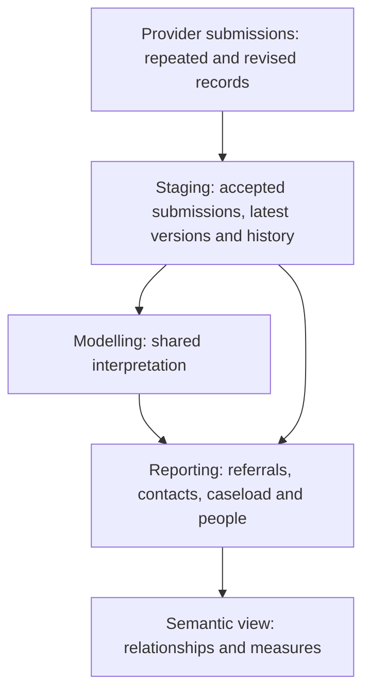

# CSDS: from submissions to useful reporting

## Goal of the layer

Make the Community Services Data Set (CSDS) simple to query for questions about
people, referrals, community care and waiting. Analysts should be able to pick a
reporting table, filter its dates and use its measures without writing their own
submission selection, deduplication or code lookups. Currency costing is kept
separate from ordinary care reporting.

Start in `REPORTING.COMMUNITY` or `REPORTING.SEMANTIC.SEM_CSDS`. The person
summary is an entry point for cohorts; referral, contact and period tables answer
questions it cannot.

## Why the source tables need preparation

CSDS is a monthly resubmission feed. Providers must send every open referral each
month, so a referral, contact or patient record appears in many months and can be
corrected later. Counting source rows counts repeats, and an older version can
leave a status out of date. Several identifiers only make sense within one
submission: contact identifiers are reused across referrals, and a contact's team
is described by the team rows sent in the same file.



- **Staging (`STAGING.CSDS`)** keeps accepted submissions only. `_history` models
  hold every accepted monthly occurrence. The latest models select the newest
  reported record for each key in the national specification (ETOS), by reporting
  period, then receipt time, submission and source row.
- **Modelling (`MODELLING.COMMUNITY`)** owns rules several outputs share.
- **Reporting (`REPORTING.COMMUNITY`)** gives analysts entities with a stated
  grain, labels and measures.

## Questions and where to start

| Analyst question | Start with | What it describes |
|---|---|---|
| What do we know about each person? | `fct_csds_person_summary`, `dim_csds_person_provider_period` | Current evidence per person; demographics and residence per person, provider and month. |
| Who is on the current recorded caseload? | `fct_csds_current_caseload_referral`, `fct_csds_current_caseload_person` | Open referrals in the dataset's latest month, including those awaiting a first attended contact. |
| What referrals were made and what followed? | `fct_csds_referral`, `fct_csds_referral_summary` | Latest referrals, with contacts, activities, teams and clocks under each. |
| What was the referral state in a past month? | `fct_csds_referral_period` | Open state and attendance evidence at each accepted period end. |
| Which teams were involved? | `fct_csds_referral_service` | Latest referral/team relationships, each with its own closure or rejection. |
| What care took place? | `fct_csds_care_contact`, `fct_csds_care_activity` | Contacts in all attendance states with delivering team and GP practice; activities within contacts. |
| What clinical detail was recorded? | `fct_csds_clinical_record` | Immunisations, assessment responses, procedures, findings and observations. |
| How quickly were people seen? | `fct_csds_referral_to_treatment_period` | Submitted clocks, including the two-hour urgent community response. |
| How recent is each provider's data? | `dq_csds_provider_submission`, `fct_csds_latest_provider_caseload_referral` | Provider submission dates and lag; open referrals in each provider's latest month. |
| What do contacts cost? | `fct_csds_currency_contacts` | NHSE community currency and proxy cost per contact. See the [currency guide](csds-currency-models.md). |

## Rules analysts must know

1. **Filter to West and North London.** About a quarter of recent contacts are
   delivered by WNL providers for other ICBs. Use `is_wnl_commissioner` on the
   contact, referral, period, caseload and clock tables for WNL-commissioned
   activity, or `is_wnl_resident` on the demographics for residents. Do not
   hard-code QMJ or QRV: current records use the WNL ICB code Z9B2Z.
2. **Current means the dataset's latest month.** Several providers stopped
   submitting CSDS between 2018 and 2024. The current caseload leaves them out;
   the latest-provider caseload keeps them with their lag.
3. **Stopping submission means closed.** A referral is open at a period end when
   it is in that month's submission, was received, has no service discharge, and
   at least one team sent that month is neither closed nor rejected. A referral
   or team no longer submitted counts as closed. A referral that has never had a
   team sent stays open and is flagged `has_no_team_recorded`.
4. **Past state comes from one period.** Filter `fct_csds_referral_period` to one
   `reporting_period_end_date`; every referral repeats each month.
5. **Attendance.** Codes 5 and 6 are attended, 3 and 7 did not attend, 2 and 4
   cancelled by patient or provider. `is_attended`, `is_dna` and `is_cancelled`
   on the contact fact apply this rule. Costing reads only the newer attendance
   status, so before 2023 its attended counts differ by about 8%.
6. **Team type is the delivering team.** `service_or_team_type_code` on a contact
   is the team the contact names, looked up in the same submission, earlier
   submissions of the referral, or other referrals' use of the same team
   identifier. Where that fails the referral's single team type is used, and
   `service_or_team_attribution_basis` says so. Filter to the three
   `contact_team*` values for a strict delivering-team view. Musculoskeletal and
   physiotherapy services are separate types: the current caseload has about four
   times as many musculoskeletal as physiotherapy referrals. Costing uses the
   referral's team, so its team types can differ from the contact fact.
7. **Two-hour urgent community response.** Use measurement type 05
   (`is_two_hour_response_clock`); type 06 is the two-day standard. Count each
   clock once with `is_latest_clock_record` and group by the month of
   `rtt_start_date`.
8. **Count distinct people across providers.** A person can be on several
   providers' caseloads, and national ID changes can split one person.

## Worked example: two-hour response rate

```sql
select
    date_trunc(month, rtt_start_date) as clock_start_month
    , count_if(is_response_standard_met) as met
    , count_if(is_response_standard_met is not null) as assessed
    , met / nullif(assessed, 0) as rate
from reporting.community.fct_csds_referral_to_treatment_period
where is_two_hour_response_clock
    and is_latest_clock_record
    and is_wnl_commissioner
group by 1
order by 1
```

`sem_csds` supplies the same figure as `two_hour_response_met_count` divided by
`two_hour_response_assessed_count`.

## Joining tables

Referral keys have different names across tables:

| Table | Column holding the referral identifier |
|---|---|
| `fct_csds_referral`, `fct_csds_referral_summary` | `source_record_id` |
| `fct_csds_care_contact`, `fct_csds_referral_service`, `fct_csds_care_activity` | `referral_id` |
| `fct_csds_referral_period`, `fct_csds_referral_to_treatment_period` | `referral_source_record_id` |

`referral_source_row_id` on the contact and team facts is a submitted CYP101 row,
not the referral identifier; joining it to the columns above returns nothing. Use
`person_provider_period_id` to join contacts, referral periods, caseload and
clocks to `dim_csds_person_provider_period`.

## What remains in modelling

| Responsibility | Model | Why it is shared |
|---|---|---|
| Contact team and practice | `int_csds_care_contact_context` | Contact reporting, currencies and segmentation need the same team type and GP practice for each contact. |
| Person population | `int_csds_person_evidence` | Sets who has evidence, and of what kind, before the summary reduces it to one row per person. |
| Observation date | `int_csds_reporting_date` | Current measures share one dataset date. |
| Currency classification | `int_csds_contact_currency`, `int_csds_currency_referral_service_type` | Costing classifies by the referral's single team type, as the NHSE grouper requires. |

## Boundaries

NHS England publishes no CSDS open-referral or caseload figure, and the national
community waiting list comes from a separate collection. An open referral without
attendance is evidence of waiting, not a waiting-list measure: health visiting and
school nursing referrals legitimately stay open for years. Some providers only
resend referrals with activity that month, so their caseload is understated.
Assessment rows are responses, not completed questionnaires.

Sections not yet modelled include group sessions, staff details, child health
screening (newborn hearing, blood spot, infant physical examination),
breastfeeding, safeguarding and special educational needs.
