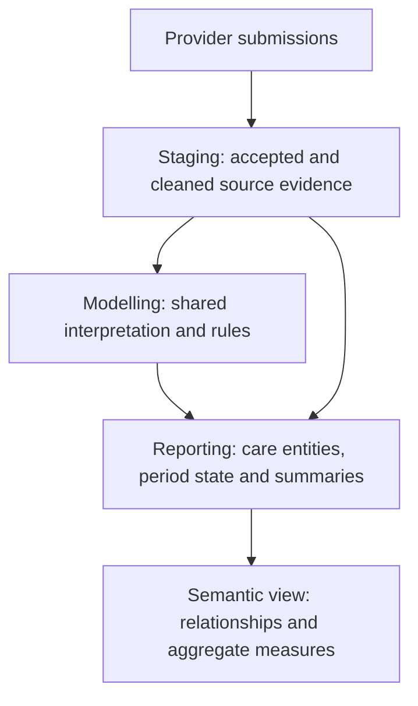

# MHSDS: from submissions to useful reporting

## Goal of the layer

Give analysts a consistent way to ask about people, demand, care and outcomes
recorded in MHSDS. Provider submissions become reporting tables with clear row
meanings, dates, labels and measures. Analysts should not need to reconstruct
monthly submissions or use costing classifications to describe ordinary care.

Start in `REPORTING.MENTAL_HEALTH`. The person summary is an entry point for
cohorts; detailed and period tables answer questions it cannot answer alone.

Source-conformed means the records consistently represent what providers
submitted. Business-conformed means the tables represent useful analytical
subjects, with an agreed interpretation. Some reporting tables can use staging
directly; shared interpretation gets a modelling table when several outputs
need it.

## Questions and what is available

| Analyst question | Reporting tables to start with | What they describe |
|---|---|---|
| What do we know about each person? | `fct_mhsds_person_summary`, `dim_mhsds_person_provider_period` | Current evidence by person, and demographics by person, provider and period. |
| Who is on the current recorded caseload? | `fct_mhsds_current_caseload_referral`, `fct_mhsds_current_caseload_person` | Open referrals in the dataset's latest month, including waiting, community and inpatient care. |
| What demand and access were recorded over time? | `fct_mhsds_referral`, `fct_mhsds_referral_period`, `fct_mhsds_referral_summary`, `fct_mhsds_referral_to_treatment_period` | Latest referrals, monthly referral state, care following each referral and submitted waiting-time clocks. |
| Which teams were involved? | `rel_mhsds_referral_service_team`, `rel_mhsds_referral_service_team_period` | Latest and period-specific team relationships, including their roles. |
| What care took place? | `fct_mhsds_care_contact`, `fct_mhsds_care_activity`, `fct_mhsds_indirect_activity`, `fct_mhsds_contact_activity_monthly` | Contacts with attendance states, activities within contacts, work without the patient present and monthly contact totals. |
| Who delivered the care? | `rel_mhsds_care_activity_staff`, `dim_mhsds_care_professional_period` | Staff linked to activities and their attributes in each submission period. |
| What group activity was recorded? | `fct_mhsds_group_session`, `fct_mhsds_group_therapy_contact`, `fct_mhsds_drop_in_contact` | Anonymous sessions and drop-ins, plus identifiable group-therapy contacts already included in contact totals. |
| What clinical needs were recorded? | `fct_mhsds_diagnosis`, `fct_mhsds_presenting_complaint`, `fct_mhsds_clinical_record` | Recorded diagnoses and complaints, plus the combined clinical-item history. |
| What circumstances were recorded? | `fct_mhsds_employment_observation`, `fct_mhsds_accommodation_observation`, `fct_mhsds_disability_observation`, `fct_mhsds_social_circumstance_observation` | Employment, accommodation, disability and social circumstances as submitted. |
| What care plans and agreements were recorded? | `fct_mhsds_care_plan_period`, `fct_mhsds_care_plan_agreement` | Plan snapshots and recorded agreements. |
| How did recorded assessment scores change? | `fct_mhsds_assessment_observation`, `fct_mhsds_assessment_instance`, `fct_mhsds_assessment_score_change` | Individual responses, possible assessment groups and changes between comparable numeric observations. |
| What inpatient care and capacity were recorded? | `fct_mhsds_hospital_provider_spell`, `fct_mhsds_ward_stay`, `fct_mhsds_inpatient_occupancy`, `fct_mhsds_current_inpatients`, `fct_mhsds_ward_capacity_period` | Recorded admissions and ward stays, inferred occupancy intervals and current inpatient evidence, and monthly reported capacity. |
| What leave or absence was recorded? | `fct_mhsds_home_leave`, `fct_mhsds_leave_of_absence`, `fct_mhsds_absence_without_leave` | Recorded leave and absence periods during inpatient care. |
| What delayed discharge, and who commissioned the stay? | `fct_mhsds_discharge_readiness_period`, `fct_mhsds_spell_commissioner_period` | Readiness and delay-reason periods, and commissioner assignments during admissions. |
| What legal status and community restrictions were recorded? | `fct_mhsds_mental_health_act_period`, `fct_mhsds_community_treatment_order`, `fct_mhsds_community_treatment_order_recall` | Legal-status periods, community treatment orders and hospital recalls. |
| What restrictive interventions were recorded? | `fct_mhsds_restrictive_intervention_incident`, `fct_mhsds_restrictive_intervention_type` | Incidents and the intervention types recorded within them. |
| How recent is the evidence? | `dq_mhsds_provider_submission`, `fct_mhsds_latest_provider_caseload_referral` | Provider reporting dates and older caseload evidence that is excluded from the common current-month view. |
| What currency classifications and estimated costs apply? | `fct_mhsds_currency_contacts`, `fct_mhsds_currency_bed_days`, `fct_mhsds_currency_current_inpatients`, `fct_mhsds_currency_referral_summary` | Costing classifications and estimates for contacts, bed days, current inpatients and referrals. |

The [reporting guide](mhsds-domain-models.md) explains each table's row meaning
and definitions. `REPORTING.SEMANTIC.SEM_MHSDS` provides named measures and
supported relationships over the care entities.

## The role of staging

`STAGING.MHSDS` is the common interface to the source sections. It selects
accepted submissions, applies source types and missing-date rules, and preserves
the history needed for period analysis. A repeated monthly row is still source
evidence, not automatically a new referral, assessment or change in circumstances.

History tables such as `stg_mhsds_referral_history` retain accepted periods.
Established latest interfaces, such as `stg_mhsds_referral`, select a record's
newest version. Staging does not decide national waiting-list eligibility,
clinical improvement or the general person-summary population.

## What remains in modelling

`MODELLING.MENTAL_HEALTH` contains rules reused by several outputs and preparation
steps for specific reporting tables. The distinction is the table's purpose,
not just how many models use it. Analysts normally start with the reporting output.

| Responsibility | Models | Reason for modelling placement |
|---|---|---|
| Contact versions and team context | `int_mhsds_latest_care_contact`, `int_mhsds_care_contact_context` | Selecting contact versions once keeps reporting, encounters and currencies on the same records. Resolving team context once keeps contact and care-activity reporting consistent. |
| Clinical evidence selection and assembly | `int_mhsds_diagnosis`, `int_mhsds_presenting_complaint`, `int_mhsds_clustering_assessment_response`, `int_mhsds_clinical_record` | Separates decisions about which submitted items represent distinct clinical evidence from their reporting labels and measures. Diagnosis, complaint and assessment reporting all use the assembled evidence. |
| Inferred inpatient occupancy | `int_mhsds_inpatient_occupancy` | Reporting, encounters and costing need the same overlap and recency decisions. A shared model prevents each output from deciding independently which stays count. |
| Ward stays within a reporting period | `int_mhsds_ward_stay_period` | Capacity reporting needs stay lengths calculated within each submission period. That differs from both latest ward-stay reporting and inferred hospital occupancy, so it has a separate calculation. |
| Person population | `int_mhsds_person_evidence` | Establishes who has evidence, and of what kind, before the summary reduces this to one row per person. Keeps population inclusion explicit and independent of whether a cross-system patient match exists. |
| Common dates and organisation names | `int_mhsds_reporting_date`, `int_mhsds_organisation` | Reports need a consistent observation date and one organisation row per code. Separate lookups prevent each report from choosing its own date or resolving duplicate organisation entries differently. |
| Currency classifications | `int_mhsds_contact_currency`, `int_mhsds_spell_currency`, `int_mhsds_currency_primary_diagnosis`, `int_mhsds_currency_referral_service_type` | Costing needs narrower diagnosis, service and eligibility choices than general care reporting. These models make those choices for the currency outputs without restricting the wider care evidence. |
| Cross-system activity and costs | `int_mhsds_carecontact_encounters`, `int_mhsds_spell_encounters`, `int_cost_index_mhsds_activity_monthly` | Convert MHSDS records into inputs for combined activity and cost reports. The combined reporting models provide the analyst interface across sources. `int_cost_index_slam_activity_monthly` supplies costs from a separate source. |

## Boundaries that matter to analysts

Current means current in the available feed. Providers can lag behind it, so
show evidence dates alongside totals. Historical questions need period facts
and period demographics. Count distinct people across providers and reduce
detail tables to a common row meaning before joining them.

Recorded open referrals do not establish clinically active treatment or national
waiting-list eligibility. Recorded diagnoses are not necessarily clinically
current. Assessment groups do not prove questionnaire completion, and score
changes do not establish improvement. Ward capacity is monthly evidence, not
live bed availability. Anonymous sessions have no patient link, and identified
group contacts have no shared session identifier.

Some source sections still need separate analytical work, including self-harm,
assaults, police assistance and digital interventions. Population access rates
also need external denominators. Eddie Davison owns the agreed recorded-state
and descriptive measure definitions.
