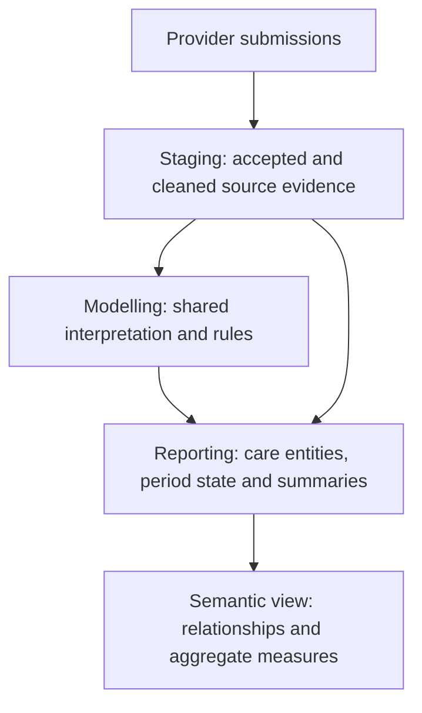

# MHSDS: from submissions to useful reporting

## Goal of the layer

Give analysts a consistent way to ask about people, demand, care and outcomes
recorded in MHSDS. Provider submissions become reporting tables with clear row
meanings, dates, labels and measures. Analysts should not need to reconstruct
monthly submissions or use costing classifications to describe ordinary care.

Start in `REPORTING.MENTAL_HEALTH`. The person summary is an entry point for
cohorts; detailed and period tables answer questions it cannot answer alone.

Source-conformed means the records consistently represent what providers
submitted. Business-conformed means the tables represent useful analytical
subjects, with an agreed interpretation. Some reporting tables can use staging
directly; shared interpretation gets a modelling table when several outputs
need it.

## Questions and what is available

| Analyst question | Reporting tables to start with | What they describe |
|---|---|---|
| What do we know about each person? | `fct_mhsds_person_summary`, `dim_mhsds_person_provider_period` | Current evidence by person, and demographics by person, provider and period. |
| Who is on the current recorded caseload? | `fct_mhsds_current_caseload_referral`, `fct_mhsds_current_caseload_person` | Open referrals in the dataset's latest month, including waiting, community and inpatient care. |
| What demand and access were recorded over time? | `fct_mhsds_referral_period`, `fct_mhsds_referral_summary`, `fct_mhsds_referral_to_treatment_period` | Monthly referral state, care following each referral and submitted waiting-time clocks. |
| What care took place, and who delivered it? | `fct_mhsds_care_contact`, `fct_mhsds_care_activity`, `fct_mhsds_indirect_activity` | Contacts with attendance states, clinical activities within contacts and work without the patient present. Staff and team relationship tables provide detail. |
| What group activity was recorded? | `fct_mhsds_group_session`, `fct_mhsds_group_therapy_contact`, `fct_mhsds_drop_in_contact` | Anonymous sessions and drop-ins, plus identifiable group-therapy contacts already included in contact totals. |
| What needs, circumstances and plans were recorded? | Clinical and circumstances families | Diagnoses, presenting complaints, employment, accommodation, disability, social circumstances, care plans and agreements. |
| How did recorded assessment scores change? | `fct_mhsds_assessment_observation`, `fct_mhsds_assessment_instance`, `fct_mhsds_assessment_score_change` | Individual responses, possible assessment groups and changes between comparable numeric observations. |
| What inpatient care and capacity were recorded? | `fct_mhsds_hospital_provider_spell`, `fct_mhsds_ward_stay`, `fct_mhsds_current_inpatients`, `fct_mhsds_ward_capacity_period` | Recorded admissions and ward stays, inferred current inpatient evidence and monthly reported capacity. |
| What affected a patient's stay or legal status? | Inpatient and clinical families | Discharge readiness and delays, leave, commissioner assignments, legal-status periods, community treatment orders, recalls and restrictive interventions. |
| How recent is the evidence? | `dq_mhsds_provider_submission`, `fct_mhsds_latest_provider_caseload_referral` | Provider reporting dates and older caseload evidence that is excluded from the common current-month view. |

The [reporting guide](mhsds-domain-models.md) lists every reporting table and its
row meaning. `REPORTING.SEMANTIC.SEM_MHSDS` provides named measures and supported
relationships over these entities. Currency tables add costing classifications
and estimates separately.

## The role of staging

`STAGING.MHSDS` is the common interface to the source sections. It selects
accepted submissions, applies source types and missing-date rules, and preserves
the history needed for period analysis. A repeated monthly row is still source
evidence, not automatically a new referral, assessment or change in circumstances.

History tables such as `stg_mhsds_referral_history` retain accepted periods.
Established latest interfaces, such as `stg_mhsds_referral`, select a record's
newest version. Staging does not decide national waiting-list eligibility,
clinical improvement or the general person-summary population.

## What remains in modelling

`MODELLING.MENTAL_HEALTH` owns the interpretation that several outputs reuse.
Analysts normally use the reporting tables built from these rules.

| Shared responsibility | Models | Why it remains here |
|---|---|---|
| Contact versions and team context | `int_mhsds_latest_care_contact`, `int_mhsds_care_contact_context` | Reporting, encounters and currencies use the same contact selection and submission-specific team attribution. |
| Clinical evidence selection and assembly | `int_mhsds_diagnosis`, `int_mhsds_presenting_complaint`, `int_mhsds_clustering_assessment_response`, `int_mhsds_clinical_record` | Resolve repeated versions and assemble evidence before the reporting tables add shared labels and expose focused clinical subjects. |
| Inpatient interpretation | `int_mhsds_inpatient_occupancy`, `int_mhsds_ward_stay_period` | Own the shared occupancy rules and period-specific recorded stay calculations. |
| Person population | `int_mhsds_person_evidence` | Includes identifiable people across all modelled evidence, even without a cross-system patient match. |
| Common dates and organisation names | `int_mhsds_reporting_date`, `int_mhsds_organisation` | Keep the observation date and organisation lookup consistent across outputs. |
| Currency classifications | `int_mhsds_contact_currency`, `int_mhsds_spell_currency`, `int_mhsds_currency_primary_diagnosis`, `int_mhsds_currency_referral_service_type` | Apply the diagnosis, service and eligibility choices needed for costing. |
| Cross-system activity and costs | `int_mhsds_carecontact_encounters`, `int_mhsds_spell_encounters`, `int_cost_index_mhsds_activity_monthly` | Adapt MHSDS care for shared encounter and estimated-cost models. `int_cost_index_slam_activity_monthly` uses a separate source. |

## Boundaries that matter to analysts

Current means current in the available feed. Providers can lag behind it, so
show evidence dates alongside totals. Historical questions need period facts
and period demographics. Count distinct people across providers and reduce
detail tables to a common row meaning before joining them.

Recorded open referrals do not establish clinically active treatment or national
waiting-list eligibility. Recorded diagnoses are not necessarily clinically
current. Assessment groups do not prove questionnaire completion, and score
changes do not establish improvement. Ward capacity is monthly evidence, not
live bed availability. Anonymous sessions have no patient link, and identified
group contacts have no shared session identifier.

Some source sections still need separate analytical work, including self-harm,
assaults, police assistance and digital interventions. Population access rates
also need external denominators. Eddie Davison owns the agreed recorded-state
and descriptive measure definitions.
