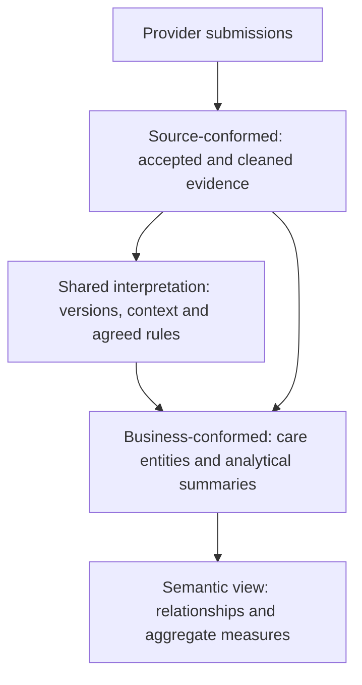

# MHSDS: from submissions to useful reporting

Start in `REPORTING.MENTAL_HEALTH` when analysing MHSDS. These tables organise
provider submissions into referrals, care, clinical evidence and people, with
defined row meanings and measures.

## The arc

| Stage | What it gives you | Example |
|---|---|---|
| Source-conformed | What providers submitted, with accepted periods and cleaned dates. A referral can appear in several monthly submissions. | `stg_mhsds_referral_history` |
| Shared interpretation | Consistent handling of repeated records and rules reused across reports. | `int_mhsds_inpatient_occupancy` resolves overlapping spells into inferred occupancy intervals. |
| Business-conformed | Tables whose rows represent a useful analytical subject, with labels, dates and measures. | `fct_mhsds_referral_period` describes a referral's recorded state in a particular submission. |
| Semantic | Named measures and supported joins over those reporting tables. | `REPORTING.SEMANTIC.SEM_MHSDS` exposes caseload, contacts and other aggregate measures. |

Analysts can work with defined care concepts without rebuilding submission
logic. Source history remains available, and reporting tables make their choice
of latest, historical or current evidence explicit.

## Choose a starting table

All tables below are in `REPORTING.MENTAL_HEALTH`.

| Your question | Start with | One row represents |
|---|---|---|
| What evidence do we have about each person? | `fct_mhsds_person_summary` | An identifiable MHSDS person, with current evidence and recorded-history measures. |
| Who is on the current recorded caseload? | `fct_mhsds_current_caseload_referral` | An open referral evidenced in the dataset's latest month, including those awaiting first attendance. |
| How many people are on that caseload? | `fct_mhsds_current_caseload_person` | A person/provider combination. Count distinct people across providers. |
| What was the referral state in an earlier month? | `fct_mhsds_referral_period` | A referral in an accepted submission, with attendance evidence available by that period end. |
| What care followed a referral? | `fct_mhsds_referral_summary` | A latest recorded referral with contact, attendance and spell measures. |
| What contacts occurred, including cancellations and DNAs? | `fct_mhsds_care_contact` | A referral/contact pair, using its latest recorded version. |
| What diagnoses were recorded? | `fct_mhsds_diagnosis` | A retained diagnosis evidence item. |
| What assessment responses were recorded? | `fct_mhsds_assessment_observation` | An assessment response or score observation. |
| Who has evidence of a current inpatient stay? | `fct_mhsds_current_inpatients` | A person with a retained open occupancy interval. |
| What capacity was reported? | `fct_mhsds_ward_capacity_period` | A ward in an accepted submission, with bed days and recorded stay evidence. |
| How does care vary by demographics? | `dim_mhsds_person_provider_period` | A person/provider/period demographic snapshot. |
| How recent is each provider's evidence? | `dq_mhsds_provider_submission` | A provider and accepted reporting period. |

The [full reporting guide](mhsds-domain-models.md) lists the other tables for
indirect and group activity, circumstances, care plans, complaints, score changes,
legal restrictions, leave and discharge readiness. Currency tables add costing
classifications to shared care definitions.

## Keep these distinctions when reporting

Current means current in the feed. Providers can lag behind the dataset's latest
month, so check submission freshness alongside totals. Use period facts and
period demographics for historical questions. Reduce facts to a common grain
before joining them, so contacts and diagnoses do not multiply each other.

An open referral is not automatically a clinically active treatment episode.
Recorded diagnoses are not necessarily clinically current. Score changes do not
establish improvement, and reported capacity is not live bed availability.
